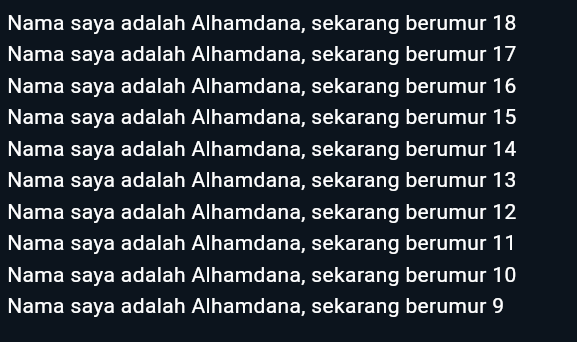

# 02 | Pengantar Bahasa Pemrograman Dart - Bagian 1
Nama: Alhamdana Fariz A.\
TI 3F - 03
# Soal 1
```dart
void main() {
  for (int i = 18; i > 8; i--) {
    print('Nama saya adalah Alhamdana, sekarang berumur $i');
  }
}
```


# Soal 2
Mengapa sangat penting untuk memahami bahasa pemrograman Dart sebelum kita menggunakan framework Flutter ? Jelaskan!
> Memahami Dart itu penting sebelum pakai Flutter karena Flutter dibangun menggunakan Dart. Dengan memahami Dart, kita bisa lebih mudah membuat kode yang benar dan cepat, terutama saat membuat program mobile. Jadi, menguasai Dart membuat kita lebih siap dan lancar dalam membuat aplikasi dengan Flutter.

# Soal 3
Rangkumlah materi dari codelab ini menjadi poin-poin penting yang dapat Anda gunakan untuk membantu proses pengembangan aplikasi mobile menggunakan framework Flutter.
- **Pengertian Dart**
  > Bahasa Dart adalah inti dari framework Flutter. Kerangka kerja modern seperti Flutter membutuhkan bahasa modern tingkat tinggi agar bisa memberikan pengalaman terbaik kepada pengembang, serta memungkinkan untuk membuat aplikasi seluler yang luar biasa. Memahami Dart adalah dasar untuk bekerja dengan Flutter; pengembang perlu mengetahui asal-usul bahasa Dart, bagaimana komunitas mengerjakannya, kelebihannya, dan mengapa itu adalah bahasa pemrograman yang dipilih untuk Flutter.
- **Evolusi Dart**
  > Dart diluncurkan pada tahun 2011, Dart telah berkembang sejak saat itu. Dart merilis versi stabilnya pada tahun 2013, dengan perubahan besar termasuk dalam rilis Dart 2.0 menjelang akhir 2018, yang dapat diuraikan sebagai berikut:
  - Telah fokus pada mobile development setelah sebelumnya berfokus pada pengembangan web
  - Mencoba memecahkan masalah pada JavaScript
  - Menawarkan performa terbaik dan alat yang lebih baik untuk proyek berskala besar
  - Dibentuk agar kuat dan fleksibel: Dengan tetap mempertahankan type annotations bersifat opsional dan menambahkan fitur OOP
- **Kelebihan Dart**
  > Dart bertujuan untuk menggabungkan kelebihan-kelebihan dari sebagian besar bahasa tingkat tinggi dengan fitur-fitur bahasa pemrograman terkini, antara lain sebagai berikut:
  - Productive tooling: merupakan fitur kakas (tool) untuk menganalisis kode, plugin IDE, dan ekosistem paket yang besar.
  - Garbage collection: untuk mengelola atau menangani dealokasi memori (terutama memori yang ditempati oleh objek yang tidak lagi digunakan).
  - Type annotations (opsional): untuk keamanan dan konsistensi dalam mengontrol semua data dalam aplikasi.
  - Statically typed: Meskipun type annotations bersifat opsional, Dart tetap aman karena menggunakan fitur type-safe dan type inference untuk menganalisis types saat runtime. Fitur ini penting untuk menemukan bug selama kompilasi kode.
  - Portability: bahasa Dart tidak hanya untuk web (yang dapat diterjemahkan ke JavaScript) tetapi juga dapat dikompilasi secara native ke kode Advanced RISC Machines (ARM) dan x86.
- **Bagaimana Dart bekerja**
  > Dart dapat mengeksekusi kode dengan dua cara, yaitu melalui Dart Virtual Machine (VM) atau dengan dikompilasi menjadi JavaScript. Eksekusi Dart didukung oleh *runtime systems*, perpustakaan inti (core libraries), dan *garbage collector*. Ada dua jenis kompilasi Dart:

  1. **Kompilasi Just-In-Time (JIT)**: Kode Dart dikompilasi saat dibutuhkan, cocok untuk pengembangan karena mendukung fitur seperti *hot reload* dan debugging.
  2. **Kompilasi Ahead-Of-Time (AOT)**: Kode Dart dikompilasi sebelumnya sehingga menghasilkan performa lebih baik, tetapi tidak mendukung *hot reload* dan debugging.

  > Fitur *hot reload* adalah salah satu keunggulan utama Flutter yang memungkinkan pengembang melihat hasil perubahan kode secara cepat, yang sangat berguna saat pengembangan aplikasi.
- **Struktur bahasa Dart**
  > Dart memiliki sintaks yang mirip dengan bahasa pemrograman lain seperti C atau JavaScript, sehingga lebih mudah dipahami jika sudah familiar dengan bahasa tersebut. Dart mendukung *object-oriented programming* (OOP) dengan konsep seperti encapsulation, inheritance, polymorphism, dan lainnya. Objek di Dart dibentuk dari kelas yang memiliki *fields* dan *methods*.

  > **Operator Dart** juga fleksibel karena operator sebenarnya adalah metode khusus dalam sebuah kelas, seperti `x == y` yang setara dengan `x.==(y)`. Operator aritmatika di Dart mirip dengan bahasa lain, seperti `+`, `-`, `*`, `/`, `~/`, `%`, dan negasi `-`. Dart juga mendukung operator *shortcut* seperti `+=`, `-=`, dan `*=`, serta operator inkrement dan dekrement (`++` dan `--`).

  > **Operator kesetaraan dan relasional** di Dart termasuk `==`, `!=`, `>`, `<`, `>=`, dan `<=`. Tidak seperti Java, `==` di Dart membandingkan isi variabel, bukan referensi memori, dan Dart tidak memerlukan `===` seperti JavaScript karena sudah memiliki *type safety*.

  > **Operator logika** di Dart meliputi `!` (negasi), `||` (OR), dan `&&` (AND) yang digunakan pada ekspresi boolean.