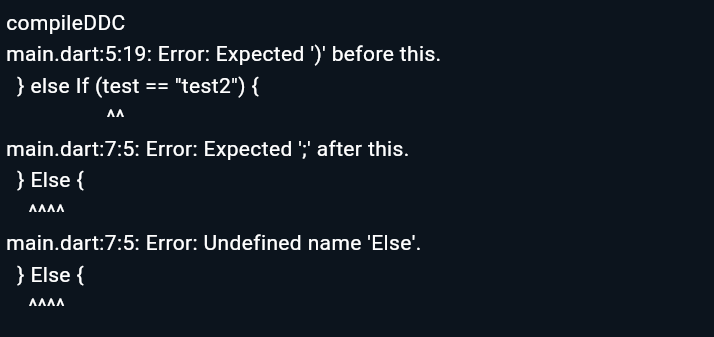

# 03 | Pengantar Bahasa Pemrograman Dart - Bagian 2
Nama: Alhamdana Fariz A.\
TI 3F - 03
# Praktikum 1: Menerapkan Control Flows ("if/else")
> Langkah 1
- Program
    ```dart
    void main() {
    String test = "test2";
    if(test == "test1"){
        print("Test1");
    }else if(test == "test2"){
        print("Test2");
    }else{
        print("Something else");
    }
    if(test=="test2") print("Test2 again");
    }
    ```
> Langkah 2
- Output
    
- Penjelasan eror\
    pada bagian "else If" penggunaan "If" seharusnya tidak menggunakan kapital "if", begitu pula pada "Else" tidak perlu menggunakan kapital menjadi "else".
- Penjelasan alur program\
    Pada bagian awal program akan membuat variabel bernama "test" yang berisikan nilai String "test2". Pada Control Flows ("if/else") akan melakukan pengecekan terhadap variabel "test" apakah brisikan nilai "test1", "test2", atau lainnya. Pengecekan tersebut mendapatkan bahwa variabel "test" berisi nilai "test2" dan akan menjalankan kondisi didalamnya "print("Test2");" untuk melakukan print "Test2", begitu pula dengan kondisi Control Flows 1 baris dibawahnya.
- Perbaikan eror
    ```dart
    void main() {
    String test = "test2";
    if(test == "test1"){
        print("Test1");
    }else if(test == "test2"){
        print("Test2");
    }else{
        print("Something else");
    }
    if(test=="test2") print("Test2 again");
    }
    ```
    
> Langkah 3
- Program
    ```dart
    void main() {
    String test = "true";
        if (test) {
            print("Kebenaran");
        }
    }
    ```
- Penjelasan\
    Akan terjadi eror dikarenakan pada bagian if() varibel "test" akan dicek dengan tipe data Boolean.
- Perbaikan kode
    ```dart
    void main() {
    bool test = true;
        if (test) {
            print("Kebenaran");
        }
    }
    ```
    Mengubah tipe data dan nilai dari variable "test" menjadi bentuk boolean.
# Praktikum 2: Menerapkan Perulangan "while" dan "do-while"
> Langkah 1
- Program
    ```dart
    void main() {
        while (counter < 33){
            print(counter);
            counter++;
        }
    }
    ```
> Langkah 2
- Penjelasan eror\
    Terjadi eror dikarenakan variabel "counter" tidak dilakukan inisialisasi terlebih dahulu.
- Perbaikan kode
    ```dart
    void main() {
        int counter = 1;
        while (counter < 33){
            print(counter);
            counter++;
        }
    }
    ```
    Program tersebut ditambahkan inisialisasi variabel "counter" dengan isi 1.
- Penjelasan alur program
Pada bagian awal program akan membuat variabel bernama "counter" yang berisikan nilai int. Pada perulangan "while" akan melakukan perulangan dan mengecek apakah data yang ada pada variabel counter tidak lebih dari 33, jika memenuhi syarat tersebut akan melakukan print nilai variabel counter dan melakukan panambahan +1 pada data variabel tersebut.
> Langkah 3
- Program
    ```Dart
    void main() {
    do {
        print(counter);
        counter++;
    } while (counter < 77);
    }
    ```
- Penjelasan eror\
    Sama seperti sebelumnya yaitu belum dilakukan inisialisasi variable "counter".
- Perbaikan kode
    ```dart
    void main() {
        int counter = 1;
        do {
            print(counter);
            counter++;
        } while (counter < 77);
    }
    ```
    
# Praktikum 3: Menerapkan Perulangan "for" dan "break-continue"
> Langkah 1
- Program
    ```dart
    void main() {
        for (Index = 10; index < 27; index) {
            print(Index);
        }
    }
    ```
> Langkah 2
- Output
    
- Penjelasan eror\
    Eror tersebut terjadi dikarenakan varibel "Index" tidak didefinisikan tipe datanya, dan juga pada program tersebut terdapat 2 variabel yaitu "Index" dan "index" yang pada saat ini harus menggunakan 1 variabel saja seperti variabel "index" (sesuai awalan variabel dengan lowercase). Pada saat di-run program, program akan melakukan looping tak terhingga dikarenakan variabel "index" tidak diberikan increment.
- Perbaikan program
    ```dart
    void main() {
    for (int index = 10; index < 27; index++) {
        print(index);
    }
    }
    ```
    
> Langkah 3
- Program 
    ```dart
    void main() {
        for (int index = 10; index < 27; index++) {
            print(index);
            If (index == 21) break;
            Else If (index > 1 || index < 7) continue;
            print(index);
        }
    }
    ```
- Output
    
    Akan terjadi eror dikarenakan terdapat variabel "Index" yang perlu diubah ke "index", variabel ini juga belum didefinisikan tipe datanya. Pada penggunaan if dan if else tidak perlu menggunakan huruf kapital pada bagian awalnya sehingga akan menggunakan format lowercase
- Perbaikan program
    ```dart
    void main() {
        for (int index = 10; index < 27; index++) {
            print(index);
            if (index == 21) break;
            else if (index > 1 || index < 7) continue;
            print(index);
        }
    }
    ```
    

# Tugas Praktikum
> Tugas
- Buatlah sebuah program yang dapat menampilkan bilangan prima dari angka 0 sampai 201 menggunakan Dart. Ketika bilangan prima ditemukan, maka tampilkan nama lengkap dan NIM Anda.
```dart
    void main() {
        for (int i = 2; i <= 201; i++) {
            bool prime = true;
            for (int j = 2; j <= i / 2; j++) {
            if (i % j == 0) {
                prime = false;
                break;
            }
            }
            if (prime) {
            print(i);
            print("Alhamdana Fariz Al Furqaan 2241720115");
            }
        }
    }
```


