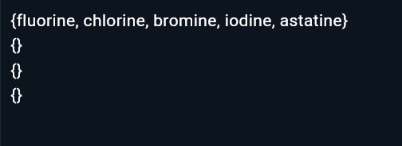
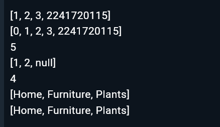
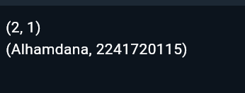

# 04 | Pengantar Bahasa Pemrograman Dart - Bagian 3
Nama: Alhamdana Fariz A.\
TI 3F - 03
# Praktikum 1: Eksperimen Tipe Data List
> Langkah 1
```dart
    void main() {
        var list = [1, 2, 3];
        assert(list.length == 3);
        assert(list[1] == 2);
        print(list.length);
        print(list[1]);

        list[1] = 1;
        assert(list[1] == 1);
        print(list[1]);
    }
```
> Langkah 2
- Output\

- Penjelasan\
Pada program akan membuat list yang berisikan 3 nilai(1,2,3). pada fungsi assert akan melakukan pengecekan apakah kondisi yang ada didalamnya benar, jika iya maka akan melakukan continue program, jika salah maka akan end dan memberikan output eror. program juga melakukan print terhadap jumlah data, data index 1 yang belum diubah dan data index 1 yang telah diubah.
> Langkah 3
- Perubahan kode
```dart
    void main(){
        final List<String?> list = List.filled(5, null);

        list[1] = 'Alhamdana';  
        list[2] = '2241720115';  
        assert(list.length == 3);
        assert(list[1] == 2);
        print(list.length);
        print(list[1]);

        list[1] = '1';
        assert(list[1] == 1);
        print(list[1]);
    }
```
- Output

Menghasilkan eror dikarenakan tidak memenugi pada syarat "list.length == 3"
# Praktikum 2: Eksperimen Tipe Data Set
> Langkah 1
```dart
    void main() {
        var halogens = {'fluorine', 'chlorine', 'bromine', 'iodine', 'astatine'};
        print(halogens);
    }
```
> Langkah 2
- Output\

- Penjelasan\
Program akan membuat set yang bernama halogens, dan kode tersebut akan mencetak elemen-elemen di dalam set.
> Langkah 3
```dart
    void main() {
    var halogens = {'fluorine', 'chlorine', 'bromine', 'iodine', 'astatine'};
    print(halogens);
    var names1 = <String>{};
    Set<String> names2 = {}; // This works, too.
    var names3 = {}; // Creates a map, not a set.

    print(names1);
    print(names2);
    print(names3);
    }
```

- Penjelasan\
Tidak ada yang ditampilkan pada program tersebut dikarenakan pada variabel names1, names2, names3 belum ada isi variabel.
- Penambahan elemen nama dan NIM
```dart
    void main() {
        var halogens = {'fluorine', 'chlorine', 'bromine', 'iodine', 'astatine'};
        print(halogens);
        var names1 = <String>{};
        Set<String> names2 = {}; // This works, too.

        names1.add("Alhamdana");
        names1.add("2241720115");
        names2.addAll({"Alhamdana","2241720115"});
        
        print(names1);
        print(names2);
    }
```

# Praktikum 3: Eksperimen Tipe Data Maps
> Langkah 1
```dart
    void main() {
        var gifts = {
            // Key:    Value
            'first': 'partridge',
            'second': 'turtledoves',
            'fifth': 1
        };

        var nobleGases = {
            2: 'helium',
            10: 'neon',
            18: 2,
        };

        print(gifts);
        print(nobleGases);
    }
```
> Langkah 2
- Output

- Penjelasan\
Kode tersebut mendefinisikan dua Map di Dart, yaitu gifts dan nobleGases.pada map gifts akan memetakan key berupa String ke value yang bisa berupa String atau int. Contoh: 'first' dipetakan ke 'partridge', 'fifth' ke 1. Sedangkan pada map `nobleGases akan memetakan key berupa int ke value berupa String atau int. Contoh: 2 dipetakan ke 'helium', 18 ke 2.
Pada bagian akhir akan melakukan print(gifts); mencetak isi gifts.print(nobleGases); mencetak isi nobleGases. Hasilnya akan menampilkan pasangan key-value dalam format {key: value}.
> Langkah 3
- Program
```dart
    void main() {
        var gifts = {
            // Key:    Value
            'first': 'partridge',
            'second': 'turtledoves',
            'fifth': 1
        };

        var nobleGases = {
            2: 'helium',
            10: 'neon',
            18: 2,
        };

        print(gifts);
        print(nobleGases);

        var mhs1 = Map<String, String>();
        gifts['first'] = 'partridge';
        gifts['second'] = 'turtledoves';
        gifts['fifth'] = 'golden rings';

        var mhs2 = Map<int, String>();
        nobleGases[2] = 'helium';
        nobleGases[10] = 'neon';
        nobleGases[18] = 'argon';
    }
```
- Output

- Penambahan kode
```dart
    void main() {
        var gifts = {
            // Key:    Value
            'first': 'partridge',
            'second': 'turtledoves',
            'fifth': 1
        };

        var nobleGases = {
            2: 'helium',
            10: 'neon',
            18: 2,
        };

        var mhs1 = Map<String, String>();
        gifts['first'] = 'partridge';
        gifts['second'] = 'turtledoves';
        gifts['fifth'] = 'golden rings';

        var mhs2 = Map<int, String>();
        nobleGases[2] = 'helium';
        nobleGases[10] = 'neon';
        nobleGases[18] = 'argon';
        
        gifts['nama']="Alhamdana";
        gifts['nim']="2241720115";
        nobleGases.addAll({100:'Alhamdana',200:'2241720115'});
        mhs1.addAll({'nama':'Alhamdana','nim':'2241720115'});
        mhs2.addAll({1:'Alhamdana',2:'2241720115'});
        
        print(gifts);
        print(nobleGases);
        print(mhs1);
        print(mhs2);
    }
```


# Praktikum 4: Eksperimen Tipe Data List: Spread dan Control-flow Operators
> Langkah 1
```dart
    void main() {
        var list = [1, 2, 3];
        var list2 = [0, ...list];
        print(list1);
        print(list2);
        print(list2.length);
    }
```
> Langkah 2
- Output

Terjadi eror dikarenakan pada tidak dailakukan inisialisasi pada "list1"
- Perbaikan eror\
merubah "list1" menjadi "list"
```dart
    void main() {
        var list = [1, 2, 3];
        var list2 = [0, ...list];
        print(list);
        print(list2);
        print(list2.length);
    }
```
- Output akhir

>langkah 3
- Program
```dart
    void main() {
        var list = [1, 2, 3];
        var list2 = [0, ...list];
        print(list);
        print(list2);
        print(list2.length);

        list1 = [1, 2, null];
        print(list1);
        var list3 = [0, ...?list1];
        print(list3.length);
    }
```
akan terjadi eror dikarenakan tidak ada "var" pada bagian awal inisialisasi list1.
- Perbaikan eror
```dart
    void main() {
        var list = [1, 2, 3];
        var list2 = [0, ...list];
        print(list);
        print(list2);
        print(list2.length);

        var list1 = [1, 2, null];
        print(list1);
        var list3 = [0, ...?list1];
        print(list3.length);
    }
```

- Penambahan variabel list berisi NIM menggunakan Spread Operators\
Penambahan nim pada bagian awal
```dart
    void main() {
        var nim = {2241720115};
        var list = [1, 2, 3, ...nim];
        var list2 = [0, ...list];
        print(list);
        print(list2);
        print(list2.length);

        var list1 = [1, 2, null];
        print(list1);
        var list3 = [0, ...?list1];
        print(list3.length);
    }
```

> langkah 4
```dart
void main() {
  var nim = {2241720115};
  var list = [1, 2, 3, ...nim];
  var list2 = [0, ...list];
  print(list);
  print(list2);
  print(list2.length);

  var list1 = [1, 2, null];
  print(list1);
  var list3 = [0, ...?list1];
  print(list3.length);
  
  var promoActive = true;
  var nav = ['Home', 'Furniture', 'Plants', if (promoActive) 'Outlet'];
  print(nav);
}
```
- hasil ketika true

- hasil ketika false

- Penjelasan\
Jika pada bagian "if (promoActive)" bernilai true akan memasukkan data 'outlet' pada variabel nav, jika false maka tidak akan melakukannya.
> langkah 5
- Kode yang telah diperbaiki
Penambahan definisi pada variabel login
```dart
    void main() {
        var nim = {2241720115};
        var list = [1, 2, 3, ...nim];
        var list2 = [0, ...list];
        print(list);
        print(list2);
        print(list2.length);

        var list1 = [1, 2, null];
        print(list1);
        var list3 = [0, ...?list1];
        print(list3.length);
        
        var promoActive = false;
        var nav = ['Home', 'Furniture', 'Plants', if (promoActive) 'Outlet'];
        print(nav);
        
        var login = 'Manager';
        var nav2 = ['Home', 'Furniture', 'Plants', if (login case 'Manager') 'Inventory'];
        print(nav2);
    }
```
- Output login manager

- Output login bukan manager

- Penjelasan\
Jika pada bagian "if (login)" bernilai Manager akan memasukkan data 'Inventory' pada variabel nav2, jika false maka tidak akan melakukannya.
> langkah 5
- Program
```dart
    void main() {
        var nim = {2241720115};
        var list = [1, 2, 3, ...nim];
        var list2 = [0, ...list];
        print(list);
        print(list2);
        print(list2.length);

        var list1 = [1, 2, null];
        print(list1);
        var list3 = [0, ...?list1];
        print(list3.length);

        var promoActive = false;
        var nav = ['Home', 'Furniture', 'Plants', if (promoActive) 'Outlet'];
        print(nav);

        var login = 'Manager';
        var nav2 = [
            'Home',
            'Furniture',
            'Plants',
            if (login case 'Manager') 'Inventory'
        ];
        print(nav2);

        var listOfInts = [1, 2, 3];
        var listOfStrings = ['#0', for (var i in listOfInts) '#$i'];
        assert(listOfStrings[1] == '#1');
        print(listOfStrings);
    }
```
- Output

- Manfaat Collection For 
Perulangan for pada program tersebut digunakan untuk mengambil semua data yang ada pada variabel "listOfInts" untuk diambil satu per satu dan dimasukkan pada variabel "listOfStrings".
# Praktikum 5: Eksperimen Tipe Data Records
> Langkah 1
```dart
    void main() {
        var record = ('first', a: 2, b: true, 'last');
        print(record)
    }
```
> Langkah 2
- Output

- Penjelasan\
Kode tersebut menggunakan record di Dart, yang merupakan tipe data untuk menyimpan beberapa nilai dengan atau tanpa label. Dalam contoh ini, record ('first', a: 2, b: true, 'last') menyimpan empat nilai: dua tanpa label ('first' dan 'last'), serta dua dengan label (a: 2 dan b: true). Saat kode print(record) dijalankan, seluruh nilai dalam record akan dicetak dalam format seperti tuple. Record memungkinkan penyimpanan data dengan tipe berbeda dalam satu struktur tanpa harus menggunakan Map atau List.
> Langkah 3
```dart
(int, int) tukar((int, int) record) {
  var (a, b) = record;
  return (b, a);
}

void main() {
  var record = ('first', a: 2, b: true, 'last');
  var record1 = (1, 2);
  var swaprecord = tukar(record1);
  print(swaprecord);
}
```


> Langkah 4
- Program
```dart
    (int, int) tukar((int, int) record) {
    var (a, b) = record;
    return (b, a);
    }

    void main() {
        var record = ('first', a: 2, b: true, 'last');
        var record1 = (1, 2);
        var swaprecord = tukar(record1);
        print(swaprecord);

        // Record type annotation in a variable declaration:
        (String, int) mahasiswa;
        mahasiswa = ("Alhamdana",2241720115);
        print(mahasiswa);
    }
```
- Output\

> Langkah 5
- Program
```dart
    (int, int) tukar((int, int) record) {
        var (a, b) = record;
        return (b, a);
    }

    void main() {
        var record = ('first', a: 2, b: true, 'last');
        var record1 = (1, 2);
        var swaprecord = tukar(record1);
        print(swaprecord);

        // Record type annotation in a variable declaration:
        (String, int) mahasiswa;
        mahasiswa = ("Alhamdana", 2241720115);
        print(mahasiswa);

        var mahasiswa2 = ('first', a: 2, b: true, 'last',nama:'Alhamdana',nim:2241720115);

        print(mahasiswa2.$1); // Prints 'first'
        print(mahasiswa2.a); // Prints 2
        print(mahasiswa2.b); // Prints true
        print(mahasiswa2.$2); // Prints 'last'
        print(mahasiswa2.nama); // Prints 'nama'
        print(mahasiswa2.nim); // Prints 'nim'
    }
```
- Output\


# Tugas Praktikum
> Tugas
2. Jelaskan yang dimaksud Functions dalam bahasa Dart!
    - Fungsi dalam Dart adalah blok kode yang dapat dipanggil untuk melakukan tugas tertentu. Fungsi ini mendukung berbagai fitur seperti parameter opsional, anonymous functions, dan closures. Fungsi dapat menerima input (parameter) dan mengembalikan output (nilai hasil).
3. Jelaskan jenis-jenis parameter di Functions beserta contoh sintaksnya!\
    - Positional Parameters\
        Parameter yang wajib diisi sesuai urutan saat memanggil fungsi.
        ```dart
        void halo(String name, int age) {
        print('Halo $name, kamu berumur $age tahun');
        }
        ```
    - Optional Positional Parameters\
        Parameter yang tidak wajib diisi, menggunakan tanda kurung []. Jika dilewati, nilainya akan null.
        ```dart
        void halo(String name, [int? age]) {
        print('Halo $name');
        }
        ```
    - Named Parameters\
        Parameter yang harus disebutkan saat memanggil fungsi, menggunakan {}. Dapat ditandai sebagai required.
        ```dart
        void halo({required String name, int? age}) {
        print('Halo $name');
        }
        ```
    - Default Parameters\
        Parameter yang memiliki nilai default jika tidak diisi saat pemanggilan fungsi.
        ```dart
        void halo(String name, {int age = 18}) {
        print('Halo $name, you are $age years old');
        }
        ```
4. Jelaskan maksud Functions sebagai first-class objects beserta contoh sintaknya!
    - Fungsi di Dart adalah first-class objects, yang berarti mereka dapat disimpan dalam variabel, dilewatkan sebagai parameter, atau dikembalikan dari fungsi lain.
        ```dart
        void sayHello() {
        print('Helloooo!');
        }

        void execute(Function f) {
        f();
        }

        void main() {
        var func = sayHello;
        execute(func);  // Output: Helloooo!
        }
        ```
5. Apa itu Anonymous Functions? Jelaskan dan berikan contohnya!
    - Anonymous functions (fungsi tanpa nama) adalah fungsi yang dideklarasikan tanpa nama dan biasanya digunakan sebagai argumen atau dalam konteks di mana fungsi hanya digunakan sekali.
        ```dart
        var list = [1, 2, 3];
        list.forEach((item) {
        print('Item: $item');
        });
        ```
6. Jelaskan perbedaan Lexical scope dan Lexical closures! Berikan contohnya!
    - Lexical scope mengacu pada akses variabel yang dibatasi oleh tempat di mana variabel tersebut dideklarasikan. Variabel yang dideklarasikan di dalam fungsi hanya dapat diakses di dalam fungsi itu sendiri.
        ```dart
        void main() {
        var outer = 'Outer';

        void inner() {
            print(outer);  // Bisa akses variabel luar
        }

        inner();
        }
        ```
    - Lexical Closures\
    Closure adalah fungsi yang dapat "mengingat" variabel yang ada di lexical scope-nya meskipun fungsi itu dieksekusi di luar scope asalnya.
        ```dart
        Function makeAdder(int x) {
        return (int y) => x + y;
        }

        void main() {
        var add5 = makeAdder(5);
        print(add5(3));  // Output: 8
        }
        ```
7. Jelaskan dengan contoh cara membuat return multiple value di Functions!
    - Dart tidak secara langsung mendukung pengembalian multiple value, namun kita bisa menggunakan List, Map, atau kelas untuk mencapai tujuan tersebut. Pemilihan metode yang tepat tergantung pada konteks masalah dan preferensi pemrogram.\
    Pada bagian ini saya akan menggunakan List
        ```dart
        List<int> hitung(int a, int b) {
        return [a + b, a - b];  // Mengembalikan dua nilai dalam List
        }

        void main() {
        var result = hitung(4, 3);
        print('Jumlah: ${result[0]}, Pengurangan: ${result[1]}');
        // Output: Jumlah: 7, Pengurangan: 1
        }
        ```