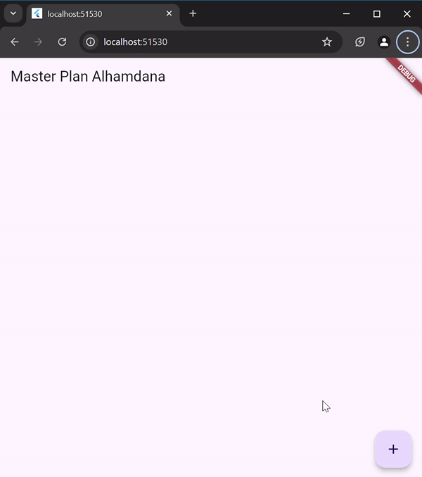
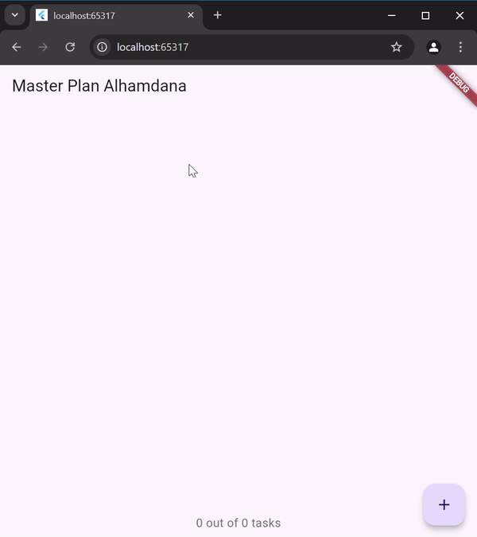
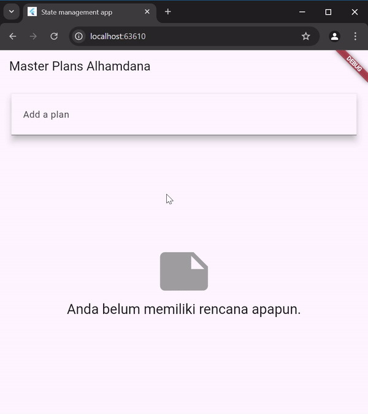

# #10 | Dasar State Management
## Alhamdana Fariz A / 2241720115
# Praktikum 1
# Tugas Praktikum 1: Dasar State dengan Model-View
1. Selesaikan langkah-langkah praktikum tersebut, lalu dokumentasikan berupa GIF hasil akhir praktikum beserta penjelasannya di file README.md! Jika Anda menemukan ada yang error atau tidak berjalan dengan baik, silakan diperbaiki.
2. Jelaskan maksud dari langkah 4 pada praktikum tersebut! Mengapa dilakukan demikian?
- Langkah 4 bertujuan untuk menyederhanakan proses impor model dengan membuat file data_layer.dart. Dengan mengekspor plan.dart dan task.dart melalui file ini, kita hanya perlu mengimpor data_layer.dart di seluruh aplikasi. Ini membuat kode lebih bersih, mempermudah penambahan model baru di masa depan, dan menjaga konsistensi impor model.
3. Mengapa perlu variabel plan di langkah 6 pada praktikum tersebut? Mengapa dibuat konstanta ?
- Variabel plan di langkah 6 digunakan sebagai data utama untuk PlanScreen, yang akan menampung dan menampilkan daftar tugas. Variabel ini dibuat sebagai const karena kita menginisialisasi Plan awal sebagai objek kosong atau default yang tidak akan diubah secara langsung. Konstanta ini memastikan nilai awal yang stabil untuk plan, sementara perubahan selanjutnya dapat dikelola melalui metode lain, seperti yang terhubung dengan state management di kemudian hari.
4. Lakukan capture hasil dari Langkah 9 berupa GIF, kemudian jelaskan apa yang telah Anda buat!
- Pada program ini akan membuat sebuah aplikasi untuk melakukan perencanaan tugas, sehingga pengguna dapat melakukan penambahan tugas yang akan dilakukan dan juga memberikan penanda jika program telah selesai dilakukan.

5. Apa kegunaan method pada Langkah 11 dan 13 dalam lifecyle state ?
- Langkah 11 (initState): Digunakan untuk menginisialisasi scrollController saat widget pertama kali dibangun. Listener ditambahkan untuk menutup keyboard otomatis ketika pengguna menggulir. Ini berguna untuk mengatur perilaku awal widget yang hanya perlu diinisialisasi sekali.
- Langkah 13 (dispose): Digunakan untuk membersihkan scrollController ketika widget dihapus dari widget tree. Ini mencegah kebocoran memori dengan memastikan bahwa scrollController tidak terus berjalan setelah widget tidak digunakan lagi.
# Tugas Praktikum 2: InheritedWidget
1. Selesaikan langkah-langkah praktikum tersebut, lalu dokumentasikan berupa GIF hasil akhir praktikum beserta penjelasannya di file README.md! Jika Anda menemukan ada yang error atau tidak berjalan dengan baik, silakan diperbaiki sesuai dengan tujuan aplikasi tersebut dibuat.
2. Jelaskan mana yang dimaksud InheritedWidget pada langkah 1 tersebut! Mengapa yang digunakan InheritedNotifier?
- Pada langkah 1, InheritedWidget adalah kelas dasar yang digunakan untuk membagikan data secara efisien ke widget-widget yang berada di bawahnya dalam widget tree. Dalam hal ini, PlanProvider adalah turunan dari InheritedNotifier<ValueNotifier<Plan>>, yang memungkinkan ValueNotifier<Plan> untuk dibagikan ke widget-widget di bawahnya.\
InheritedNotifier digunakan daripada InheritedWidget karena InheritedNotifier tidak hanya menyediakan akses ke data (seperti InheritedWidget), tetapi juga memungkinkan untuk memberi tahu widget yang bergantung tentang perubahan data. Ini memudahkan pembaruan UI ketika nilai di dalam ValueNotifier<Plan> berubah.
3. Jelaskan maksud dari method di langkah 3 pada praktikum tersebut! Mengapa dilakukan demikian?
- Pada langkah 3, dua method ditambahkan ke dalam model Plan:\
completedCount: Menghitung jumlah tugas yang telah selesai dengan memeriksa properti complete pada setiap tugas di dalam daftar tasks. Ini memberikan jumlah tugas yang telah selesai.\
completenessMessage: Menghasilkan pesan yang menunjukkan berapa banyak tugas yang telah selesai dari total jumlah tugas, misalnya "3 out of 5 tasks".\
Tujuan dari penambahan method ini adalah untuk memudahkan penghitungan dan menampilkan progres dari daftar tugas di Plan tanpa perlu menghitungnya secara manual di tempat lain dalam aplikasi.
4. Lakukan capture hasil dari Langkah 9 berupa GIF, kemudian jelaskan apa yang telah Anda buat!
- Pada program ini tidak ada perubahan tampilan terhadap program pada praktikum sebelumnya, akan tetapi pada program kali ini akan menggunakan state model yang baik antara view dan model.

# Tugas Praktikum 3: State di Multiple Screens
1. Selesaikan langkah-langkah praktikum tersebut, lalu dokumentasikan berupa GIF hasil akhir praktikum beserta penjelasannya di file README.md! Jika Anda menemukan ada yang error atau tidak berjalan dengan baik, silakan diperbaiki sesuai dengan tujuan aplikasi tersebut dibuat.
2. Berdasarkan Praktikum 3 yang telah Anda lakukan, jelaskan maksud dari gambar diagram berikut ini!
- Diagram ini menunjukkan struktur pohon widget dari aplikasi Flutter sebelum dan sesudah melakukan operasi Navigator.push, yang memungkinkan aplikasi untuk berpindah dari satu layar ke layar lainnya.

> Sebelum Navigator.push
- Di sebelah kiri:\
Pohon widget dimulai dengan MaterialApp di bagian paling atas.
PlanProvider digunakan untuk membungkus widget berikutnya, PlanCreatorScreen.
PlanCreatorScreen memiliki struktur yang terdiri dari Column yang berisi beberapa widget:
TextField untuk menginput teks.
Expanded yang berisi ListView untuk menampilkan daftar item.
> Setelah Navigator.push
- Di sebelah kanan:\
Struktur pohon widget tetap dimulai dengan MaterialApp, namun PlanCreatorScreen telah digantikan oleh PlanScreen karena operasi Navigator.push.
PlanScreen menggunakan Scaffold sebagai struktur dasar, dengan Column yang berisi beberapa widget:
Expanded yang berisi ListView, mirip dengan struktur sebelumnya.
SafeArea yang berisi Text, menampilkan teks pada bagian bawah layar dengan aman, menghindari area yang mungkin terpotong oleh antarmuka (seperti notch atau indikator layar penuh).
3. Lakukan capture hasil dari Langkah 14 berupa GIF, kemudian jelaskan apa yang telah Anda buat!
- Pada program ini akan menambahkan bagian jenis plan dan juga terdapat sub-sub plan yang berada didalamnya.
