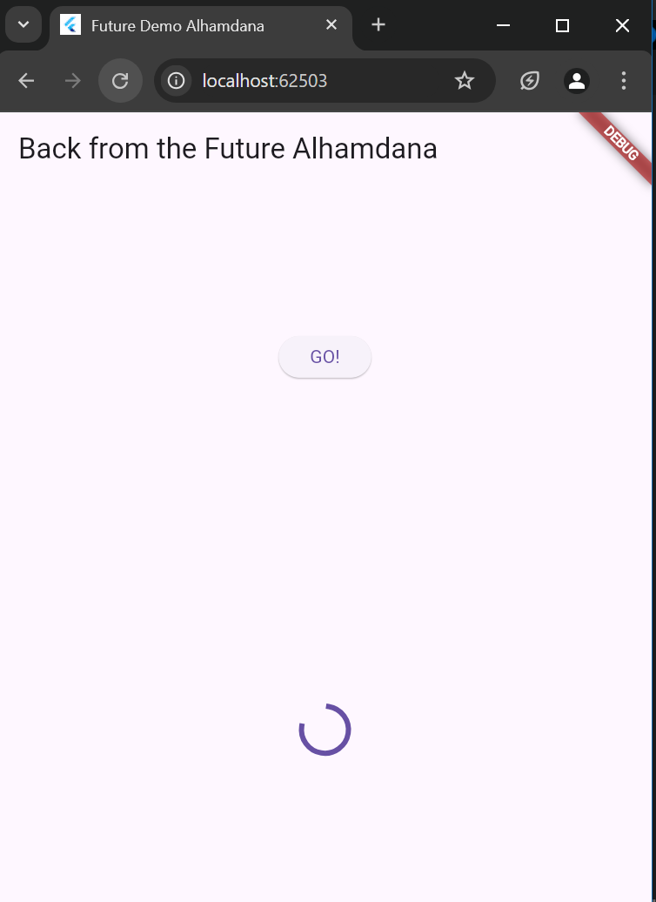
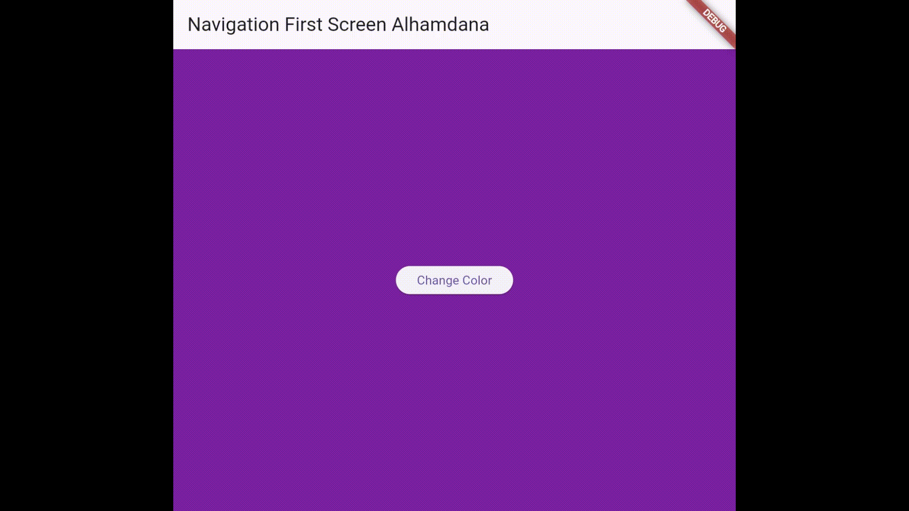

# #11 | Pemrograman Asynchronous
## Alhamdana Fariz A / 2241720115

## Soal 1
### Tambahkan nama panggilan Anda pada title app sebagai identitas hasil pekerjaan Anda.

## Soal 2
### Carilah judul buku favorit Anda di Google Books, lalu ganti ID buku pada variabel path di kode tersebut.
```dart
Future<Response> GetData() async{
    const authority = 'www.googleapis.com';
    const path = '/books/v1/volumes/736zEAAAQBAJ';
    Uri url = Uri.https(authority, path);
    return http.get(url);
  }
```
### Kemudian cobalah akses di browser URI tersebut dengan lengkap seperti ini. Jika menampilkan data JSON, maka Anda telah berhasil. Lakukan capture milik Anda dan tulis di README pada laporan praktikum. Lalu lakukan commit dengan pesan "W11: Soal 2".

## Soal 3
### Jelaskan maksud kode langkah 5 tersebut terkait substring dan catchError!

Kode tersebut mengambil data menggunakan fungsi getData() dan:
- substring(0, 450): Memotong teks dari respon API hingga 450 karakter pertama, untuk mencegah teks terlalu panjang.
- catchError:
Menangani kesalahan jika getData() gagal.
Mengatur nilai result menjadi "An error occurred" jika terjadi error.
### Capture hasil praktikum Anda berupa GIF dan lampirkan di README. Lalu lakukan commit dengan pesan "W11: Soal 3".

## Soal 4
### Jelaskan maksud kode langkah 1 dan 2 tersebut!
- Langkah 1: Mendefinisikan tiga fungsi asinkron (returnOneAsync, returnTwoAsync, returnThreeAsync) yang:\
Menunda eksekusi selama 3 detik menggunakan Future.delayed. Mengembalikan nilai masing-masing: 1, 2, dan 3.

- Langkah 2: Membuat fungsi count() yang:\
Menggunakan await untuk menunggu hasil dari fungsi asinkron di Langkah 1 secara berurutan.
Menjumlahkan hasilnya ke variabel total.
Memperbarui UI dengan setState() untuk menampilkan hasil total.
### Capture hasil praktikum Anda berupa GIF dan lampirkan di README. Lalu lakukan commit dengan pesan "W11: Soal 4".

## Soal 5
### Jelaskan maksud kode langkah 2 tersebut!
Kode tersebut menggunakan Completer untuk mengontrol penyelesaian sebuah Future secara manual:
- getNumber():\
Membuat sebuah Completer<int>.
Memulai proses asinkron melalui calculate().
Mengembalikan completer.future sebagai Future yang akan selesai nantinya.
- calculate():\
Menunggu 5 detik menggunakan Future.delayed.
Menyelesaikan completer dengan nilai 42 menggunakan completer.complete(42).

Artinya, Future dari getNumber() akan selesai dengan nilai 42 setelah 5 detik.
### Capture hasil praktikum Anda berupa GIF dan lampirkan di README. Lalu lakukan commit dengan pesan "W11: Soal 5".

## Soal 6
### Jelaskan maksud perbedaan kode langkah 2 dengan langkah 5-6 tersebut!
Perbandingan Langkah 2 dengan Langkah 5-6:

- Penanganan Error:\
Langkah 2: Tidak menangani error. Jika terjadi kesalahan dalam calculate(), program akan gagal tanpa penanganan.\
Langkah 5: Menambahkan try-catch untuk menangani error. Jika ada error, Future diselesaikan dengan completer.completeError.
- Penerapan Hasil Future:\
Langkah 2: Tidak ada mekanisme untuk memproses hasil atau error dari getNumber() secara eksplisit.\
Langkah 6: Menggunakan then untuk menangani hasil sukses dan catchError untuk menangani error dari getNumber().

Kesimpulan:
Langkah 5-6 lebih lengkap karena menangani error (Langkah 5) dan memproses hasil (Langkah 6), sementara Langkah 2 hanya menyelesaikan Future tanpa penanganan error atau pengolahan hasil.
### Capture hasil praktikum Anda berupa GIF dan lampirkan di README. Lalu lakukan commit dengan pesan "W11: Soal 6".

## Soal 7
### Capture hasil praktikum Anda berupa GIF dan lampirkan di README. Lalu lakukan commit dengan pesan "W11: Soal 7".

## Soal 8
### Jelaskan maksud perbedaan kode langkah 1 dan 4!
- Langkah 1 menggunakan FutureGroup, yang memerlukan penambahan Future secara manual dengan add() dan harus ditutup dengan close() sebelum memproses hasilnya. Program ini lebih kompleks karena membutuhkan langkah-langkah eksplisit untuk mengelola Futures.

- Langkah 4 menggunakan Future.wait, yang langsung menggabungkan beberapa Future dalam satu langkah, tanpa memerlukan pengelolaan manual seperti pada FutureGroup. Ini lebih sederhana dan efisien.

Kesimpulan: Langkah 4 menyederhanakan pengelolaan Futures dengan otomatisasi yang tidak memerlukan langkah manual seperti pada Langkah 1.
## Soal 9
### Capture hasil praktikum Anda berupa GIF dan lampirkan di README. Lalu lakukan commit dengan pesan "W11: Soal 9".

## Soal 10
### Panggil method handleError() tersebut di ElevatedButton, lalu run. Apa hasilnya? Jelaskan perbedaan kode langkah 1 dan 4!
- returnError: Fungsi ini sengaja membuat program menunggu 2 detik sebelum menghasilkan sebuah kesalahan (exception).
- handleError: Fungsi ini memanggil returnError, kemudian mencoba menangkap kesalahan yang dihasilkan. Jika ada kesalahan, pesan kesalahan akan disimpan dalam variabel result. Terakhir, terlepas dari ada atau tidaknya kesalahan, fungsi ini selalu mencetak "Complete".
## Soal 11
### Tambahkan nama panggilan Anda pada tiap properti title sebagai identitas pekerjaan Anda.
```dart
appBar: AppBar(
        title: const Text('Location Alhamdana'),
      ),
```
## Soal 12
### Jika Anda tidak melihat animasi loading tampil, kemungkinan itu berjalan sangat cepat. Tambahkan delay pada method getPosition() dengan kode await Future.delayed(const Duration(seconds: 3));
```dart
Future<Position> getPosition() async {
    Future.delayed(const Duration(seconds: 3));
    await Geolocator.requestPermission();
    await Geolocator.isLocationServiceEnabled();
    Position? position = 
      await Geolocator.getCurrentPosition();
    return position;
  }
```
### Apakah Anda mendapatkan koordinat GPS ketika run di browser? Mengapa demikian?
Program saya menampilkan lokasi saya setelah izin diberikan, Geolocator dapat memanfaatkan API lokasi browser untuk menyediakan koordinat GPS pengguna, sehingga aplikasi berfungsi seperti di perangkat asli.
### Capture hasil praktikum Anda berupa GIF dan lampirkan di README. Lalu lakukan commit dengan pesan "W11: Soal 12".

## Soal 13
### Apakah ada perbedaan UI dengan praktikum sebelumnya? Mengapa demikian?
Pada tampilan UI saja tidak ada perubahan, akan tetapi pada proses loading, indicator loading berjalan lebih lama yaitu 3 detik, bukan 1 detik seperti sebelumnya. Ini karena penambahan delay pada method getPosition() dengan kode await Future.delayed(const Duration(seconds: 3))
### Capture hasil praktikum Anda berupa GIF dan lampirkan di README. Lalu lakukan commit dengan pesan "W11: Soal 13".

## Soal 14
### Apakah ada perbedaan UI dengan langkah sebelumnya? Mengapa demikian?
Tidak ada perubahan UI, dikarenakan program yang baru ditambahkan hanya berguna untuk menangani eror.
### Capture hasil praktikum Anda berupa GIF dan lampirkan di README. Lalu lakukan commit dengan pesan "W11: Soal 14".

## Soal 15
### Tambahkan nama panggilan Anda pada tiap properti title sebagai identitas pekerjaan Anda.
```dart
appBar: AppBar(
        title: const Text('Navigation First Screen Alhamdana'),
      ),
```
### Silakan ganti dengan warna tema favorit Anda.
## Soal 16
### Cobalah klik setiap button, apa yang terjadi ? Mengapa demikian ? Gantilah 3 warna pada langkah 5 dengan warna favorit Anda!
Ketika tombol 'Change Color' ditekan, akan muncul tiga pilihan tombol lainnya. Setiap tombol pilihan ini memiliki fungsi masing-masing untuk mengubah warna latar belakang menjadi warna yang berbeda-beda.
### Capture hasil praktikum Anda berupa GIF dan lampirkan di README. Lalu lakukan commit dengan pesan "W11: Soal 16".

## Soal 17
### Cobalah klik setiap button, apa yang terjadi ? Mengapa demikian ? Gantilah 3 warna pada langkah 3 dengan warna favorit Anda!
Ketika tombol dengan warna tertentu ditekan, halaman akan berpindah. Setelah ditambahkannya kode pada fungsi _showColorDialog(), ketika tombol itu ditekan, akan muncul pesan pop-up terlebih dahulu sebelum halaman berpindah. Perubahan ini terjadi karena di dalam fungsi _showColorDialog() terdapat kode yang membuat dialog alert (kotak pesan) yang menampilkan pesan tersebut.
### Capture hasil praktikum Anda berupa GIF dan lampirkan di README. Lalu lakukan commit dengan pesan "W11: Soal 17".
