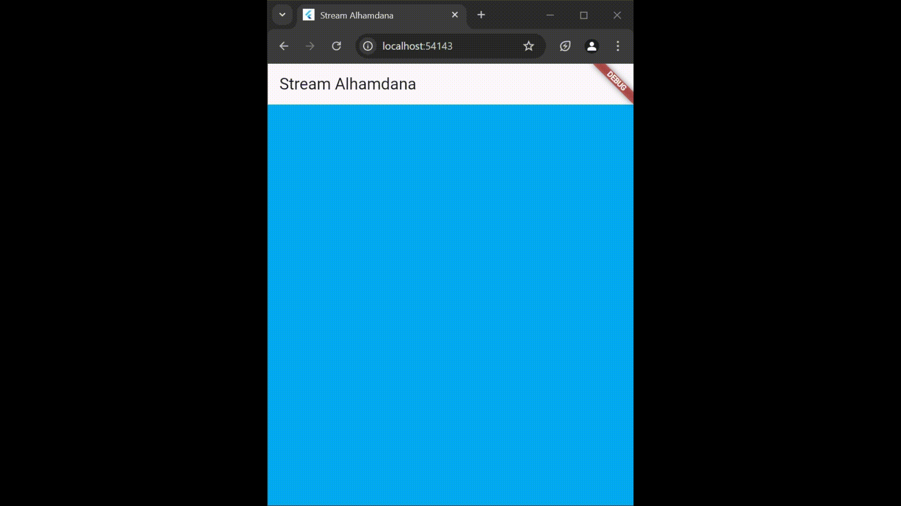
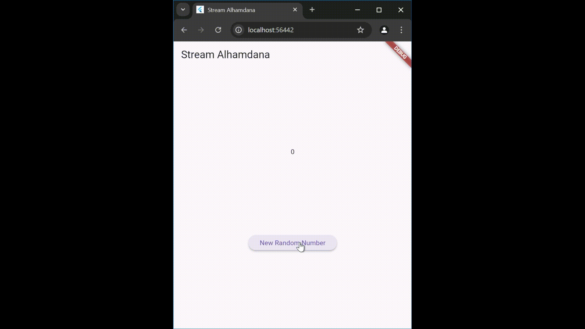
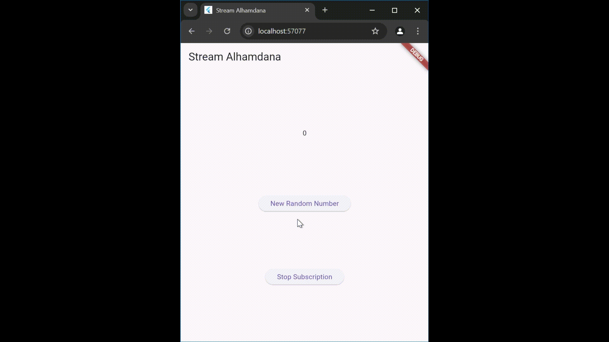
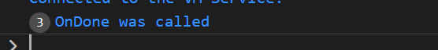
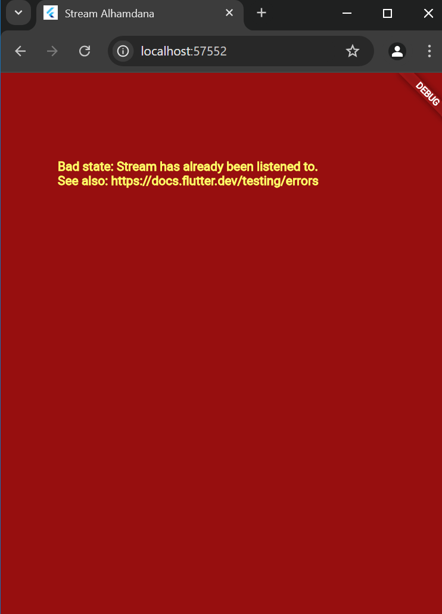
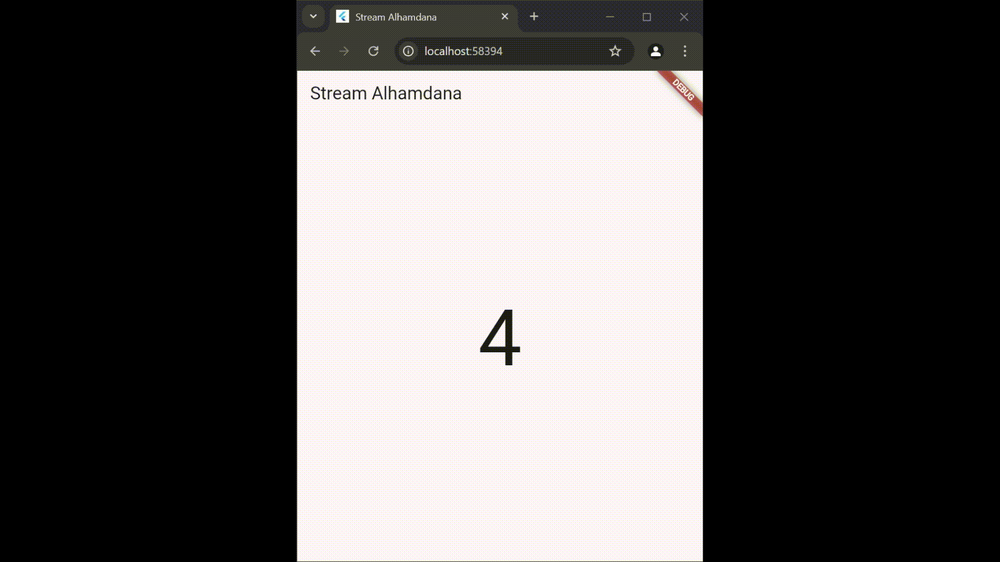
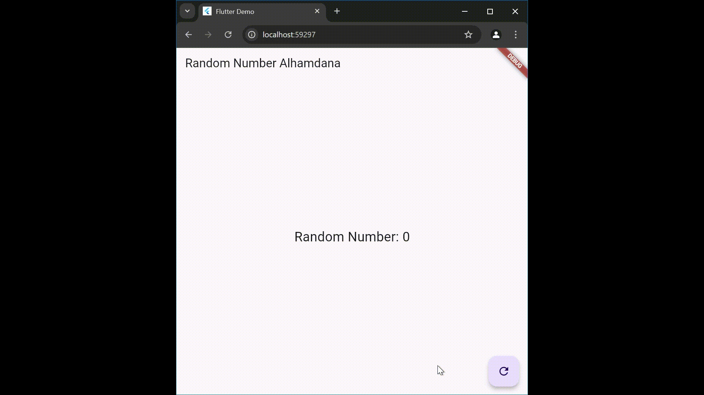

# #12 | Lanjutan State Management dengan Streams
## Alhamdana Fariz A / 2241720115

## Soal 1
### Tambahkan nama panggilan Anda pada title app sebagai identitas hasil pekerjaan Anda.
### Gantilah warna tema aplikasi sesuai kesukaan Anda.
```dart
@override
  Widget build(BuildContext context) {
    return MaterialApp(
      title: 'Stream Alhamdana',
      theme: ThemeData(
        primarySwatch: Colors.red,
      ),
      home: const StreamHomePage(),
    );
  }
```
## Soal 2
### Tambahkan 5 warna lainnya sesuai keinginan Anda pada variabel colors tersebut.
```dart
final List<Color> colors = [
    Colors.blueGrey,
    Colors.amber,
    Colors.deepPurple,
    Colors.lightBlue,
    Colors.teal,
    Colors.black,
    Colors.amberAccent,
    Colors.deepOrange,
    Colors.redAccent,
    Colors.lightGreen
  ];
```

## Soal 3
### Jelaskan fungsi keyword yield* pada kode tersebut!
- Keyword yield* pada Dart digunakan dalam fungsi generator untuk menghasilkan (yield) nilai-nilai dari iterable atau stream lain. Dengan kata lain, yield* memungkinkan kita "meneruskan" nilai-nilai dari iterable atau stream lain tanpa perlu melakukan iterasi manual.
### Apa maksud isi perintah kode tersebut?
- Kode tersebut membuat sebuah stream yang menghasilkan nilai dari array colors secara berulang setiap detik. Misalnya, jika colors = ['red', 'blue', 'green'], maka stream akan menghasilkan:
red -> blue -> green -> red -> blue -> green -> ...
dan seterusnya dengan interval 1 detik.
Jika ditulis dengan yield* dalam fungsi generator, kode ini bisa digunakan untuk mem-forward nilai dari stream Stream.periodic ke tempat lain yang membutuhkannya.

## Soal 4
### Capture hasil praktikum Anda berupa GIF dan lampirkan di README.


## Soal 5
### Jelaskan perbedaan menggunakan listen dan await for (langkah 9) !
- listen: Fleksibel untuk menangani event, error, atau stream selesai, cocok untuk logika kompleks atau kontrol manual (pause/resume/cancel).
- await for: Sederhana dan mudah dibaca, ideal untuk memproses semua event secara berurutan tanpa kontrol tambahan.

## Soal 6
### Jelaskan maksud kode langkah 8 dan 10 tersebut!
- Langkah 8:\
Membuat instance stream (numberStream) dan controller (numberStreamController), lalu mendengarkan stream. Setiap event yang dipancarkan oleh stream akan diubah menjadi nilai baru untuk lastNumber melalui setState, sehingga UI diperbarui.

- Langkah 10:\
Menambahkan angka acak (0–9) ke stream menggunakan metode addNumberToSink, sehingga nilai tersebut dipancarkan oleh stream dan diterima oleh listener di langkah 8.
### Capture hasil praktikum Anda berupa GIF dan lampirkan di README.


## Soal 7
### Jelaskan maksud kode langkah 13 sampai 15 tersebut!
- Langkah 13:\
Fungsi addError() menambahkan error ke stream menggunakan controller.sink.addError('Error'). Ini menyebabkan stream memancarkan sebuah error yang bisa ditangani oleh listener yang mendengarkan stream.

- Langkah 14:\
Pada stream listener, .onError((error) {...}) digunakan untuk menangani error yang dipancarkan oleh stream. Ketika error terjadi, lastNumber diubah menjadi -1, yang mungkin menandakan adanya kesalahan dalam aliran data.

- Langkah 15\ 
Perintah addRandomNumber() menambahkan komentar pada dua baris kode, yang sebelumnya berfungsi untuk menghasilkan angka acak dan menambahkannya ke stream. Baris-baris tersebut kini dinonaktifkan, jadi tidak ada angka acak yang akan dipancarkan ke stream ketika fungsi ini dipanggil.

## Soal 8
### Jelaskan maksud kode langkah 1-3 tersebut!
Kode Langkah 1-3 menerapkan transformasi stream dalam aplikasi Flutter menggunakan StreamTransformer. Transformasi ini mengalikan setiap nilai integer dalam stream dengan 10. Selain itu, kesalahan dalam proses ditangani, dan hasil transformasi diperbarui ke dalam state lastNumber, sehingga antarmuka pengguna dapat diperbarui sesuai perubahan nilai.
### Capture hasil praktikum Anda berupa GIF dan lampirkan di README.


## Soal 9
### Jelaskan maksud kode langkah 2, 6 dan 8 tersebut!
- Langkah 2:\
Membuat subscription untuk memantau perubahan nilai pada stream. Ketika stream memancarkan data baru, nilai tersebut digunakan untuk memperbarui state lastNumber, yang dapat memicu pembaruan antarmuka pengguna.

- Langkah 6:\
Menghentikan subscription terhadap stream untuk menghemat sumber daya ketika pemantauan tidak lagi diperlukan.

- Langkah 8:\
Memanfaatkan StreamController untuk mengirimkan data acak ke stream. Jika stream sudah ditutup, program menangani kondisi tersebut dengan mengubah state lastNumber menjadi -1 sebagai indikator kesalahan.
### Capture hasil praktikum Anda berupa GIF dan lampirkan di README.




## Soal 10

### Jelaskan mengapa error itu bisa terjadi ?
Error terjadi karena stream memiliki dua listener aktif. Stream standar hanya mengizinkan satu listener pada satu waktu.

## Soal 11
### Jelaskan mengapa hal itu bisa terjadi ?
Ketika broadcast stream digunakan, stream dapat memiliki lebih dari satu listener secara bersamaan. Namun, semua listener akan menerima nilai yang sama secara bersamaan setiap kali stream memancarkan event. Akibatnya, jika terdapat dua listener yang mendengarkan stream yang sama, keduanya akan menerima nilai yang identik.
### Capture hasil praktikum Anda berupa GIF dan lampirkan di README.


## Soal 12
### Jelaskan maksud kode pada langkah 3 dan 7 !
- Langkah 3: \
Membuat stream untuk menghasilkan angka acak secara berulang. Angka tersebut dipancarkan ke listener melalui mekanisme sink.

- Langkah 7: \
Menggunakan StreamBuilder untuk menampilkan data dari stream. Jika ada data baru, snapshot.data akan ditampilkan dalam widget Text. Jika terjadi error, kesalahan akan dicatat dalam log.
### Capture hasil praktikum Anda berupa GIF dan lampirkan di README.


## Soal 13
### Jelaskan maksud praktikum ini ! Dimanakah letak konsep pola BLoC-nya ?

Praktikum ini membahas penerapan pola BLoC pada Flutter untuk menciptakan aplikasi yang lebih terstruktur dan mudah dikelola. Dengan pola BLoC, logika bisnis dipisahkan dari tampilan, sehingga pengembangan dan pemeliharaan aplikasi menjadi lebih efisien. Dalam praktik ini, pola BLoC digunakan untuk menghasilkan angka acak. Kelas RandomBloc bertugas menyediakan aliran data untuk angka acak, sementara kelas RandomScreen bertugas menampilkan angka tersebut. Tombol refresh pada RandomScreen digunakan untuk memicu fungsi generateRandom() di kelas RandomBloc, yang menghasilkan angka acak baru. Praktikum ini secara keseluruhan menunjukkan bagaimana pola BLoC dapat meningkatkan organisasi dalam pengembangan aplikasi Flutter.
### Capture hasil praktikum Anda berupa GIF dan lampirkan di README.

